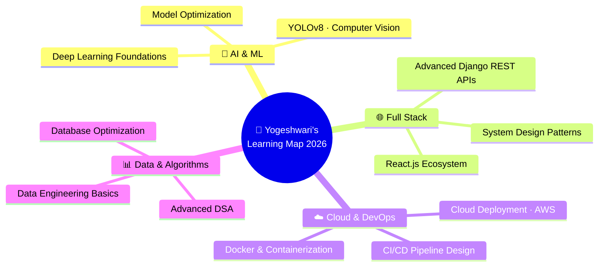

<div align="center">


</div>

<div align="center">

<a href="https://github.com/Yogeshwari7887">
  
</a>

<br/><br/>

<a href="https://github.com/Yogeshwari7887">
  
</a>&ensp;
<a href="https://github.com/Yogeshwari7887?tab=followers">
  
</a>&ensp;
&ensp;


</div>

<br/>

---

<div align="center">

## ❝ &nbsp;`Code is poetry — write it beautifully.`&nbsp; ❞

</div>

---

## 🧬 &nbsp;`whoami`

```python
class Yogeshwari:
    """Full Stack Developer | Python Engineer | AI Enthusiast"""

    def __init__(self):
        self.name       = "Yogeshwari Sudhakar Kalaskar"
        self.location   = "Pune, Maharashtra, India 🇮🇳"
        self.education  = "B.Tech IT @ VIT Pune  ·  CGPA: 9.4 / 10"
        self.training   = "Full Stack Python @ Passion Software Solutions Pvt. Ltd."
        self.email      = "yogeshwari7887@gmail.com"
        self.roles      = ["Full Stack Developer", "Python Engineer", "AI Builder"]
        self.superpowers= ["Clean Architecture", "AI Integration", "Rapid Prototyping"]

    def current_focus(self) -> list[str]:
        return [
            "🤖  AI-Powered Web Applications (YOLOv8 + Django)",
            "🌐  Full Stack Engineering  —  React · Django REST · Flask",
            "📦  Scalable Backends & Database Optimization",
            "🧠  Advanced DSA & Competitive Programming",
            "☁️   Cloud Deployment · Docker · CI/CD Pipelines",
        ]

    def philosophy(self) -> str:
        return "Ship fast. Think deeply. Build things that matter."

me = Yogeshwari()
print(me.philosophy())
# → Ship fast. Think deeply. Build things that matter.
```

---

## 🏛️ &nbsp;About Me

<table>
<tr>
<td width="52%" valign="top">

**A full-stack engineer and AI builder** based in Pune, currently pursuing **B.Tech in Information Technology** at Vishwakarma Institute of Technology with a CGPA of **9.4/10**.

I design and ship production-ready web applications, intelligent computer-vision systems, and scalable backend services — blending academic excellence with hands-on industry practice from my **7-week intensive training** at Passion Software Solutions.

My approach: **ruthlessly clean code**, thoughtful system design, and genuine care for the end user's experience.

</td>
<td width="48%" valign="top">

```
╔══════════════════════════════════════╗
║         QUICK STATS                  ║
╠══════════════════════════════════════╣
║  🎓  B.Tech IT @ VIT Pune            ║
║  📊  9.4 / 10  CGPA                  ║
║  🏅  91.49%   Diploma in CS Engg.    ║
║  🏢  Passion Software Solutions      ║
║  ⏱   7-Week Full Stack Training      ║
║  🚀  3 Production-Grade Projects     ║
║  🎯  92% Accuracy — YOLOv8 AI Model  ║
║  ⚡  40% Faster Emergency Response   ║
╚══════════════════════════════════════╝
```

</td>
</tr>
</table>

---

## ⚡ &nbsp;Tech Stack & Arsenal

<div align="center">

### ◈ &nbsp;Languages


### ◈ &nbsp;Frameworks & Libraries


### ◈ &nbsp;Databases & Tools


</div>

<br/>

<div align="center">

| Language | Proficiency | Framework / Tool | Proficiency |
|:---|:---:|:---|:---:|
| 🐍 Python | `████████████` Expert | ⚙️ Django | `██████████░░` Advanced |
| 🐘 PHP | `██████████░░` Advanced | 🌶️ Flask | `██████████░░` Advanced |
| 🗄️ SQL | `████████████` Expert | ⚛️ React.js | `████████░░░░` Intermediate |
| 🌐 JavaScript | `████████░░░░` Intermediate | 🎨 Bootstrap | `██████████░░` Advanced |
| ☕ Java | `██████░░░░░░` Intermediate | 🧠 YOLOv8 / OpenCV | `████████░░░░` Intermediate |
| 🔵 C / C++ | `█████████░░░` Advanced | 🗃️ MySQL / MongoDB | `██████████░░` Advanced |

</div>

---

## 🚀 &nbsp;Featured Projects

<table>
<tr>

<td width="33%" valign="top">

<div align="center">

### 🚦 AI Smart Traffic System
`Jan 2026` &nbsp;·&nbsp; `Computer Vision`

</div>

---

Intelligent traffic control that **detects emergency vehicles** using **YOLOv8** and autonomously generates green signal corridors in real-time to cut emergency response times.

**✦ Impact**
- 🎯 **92% detection accuracy**
- ⚡ **40% faster** emergency response
- 📡 Real-time signal synchronization
- 📊 Live traffic analytics dashboard

**✦ Stack**


</td>

<td width="33%" valign="top">

<div align="center">

### 🌿 GrowPure
`Full Stack` &nbsp;·&nbsp; `E-Commerce`

</div>

---

Production-grade **organic e-commerce platform** with complete business workflows — from product discovery to checkout, order tracking, and an admin control center.

**✦ Impact**
- 🔐 Secure auth & session management
- 🛒 Cart, wishlist, and coupon engine
- 📦 Real-time order tracking
- 🎨 Fully responsive, mobile-first UI

**✦ Stack**


</td>

<td width="33%" valign="top">

<div align="center">

### 💙 YourHearingEar
`Sep 2025` &nbsp;·&nbsp; `Mental Health Tech`

</div>

---

A **compassionate counseling platform** providing structured guidance, empathetic support flows, and meaningful user interactions — built with ethics and user trust at its core.

**✦ Impact**
- 🧭 Structured multi-step guidance
- 💬 Conversational support system
- 🤝 Ethics-first UX architecture
- 🛡️ Trust-centered data handling

**✦ Stack**


</td>

</tr>
</table>

---

## 📊 &nbsp;GitHub Analytics

<div align="center">


</div>

<div align="center">


&ensp;


</div>

<br/>

<div align="center">


</div>

---

## 🧩 &nbsp;DSA & Competitive Programming

<div align="center">

[](https://leetcode.com/Yogeshwari7887)&ensp;
[](https://www.codechef.com/users/yogeshwari7887)&ensp;
[](https://www.hackerrank.com/yogeshwari7887)&ensp;
[](https://codeforces.com/profile/yogeshwari7887)&ensp;
[](https://www.geeksforgeeks.org/user/yogeshwari7887)

</div>

<br/>

<div align="center">

| 🏆 Platform | 🎯 Focus | 📈 Activity |
|:---:|:---|:---:|
|  | Data Structures & Algorithms | 🟢 Active |
|  | Competitive Programming | 🟢 Active |
|  | Python & SQL Challenges | 🟢 Active |
|  | Algorithmic Problem Solving | 🟢 Active |
|  | CS Fundamentals & Practice | 🟢 Active |

</div>

---

## 📚 &nbsp;Currently Learning



<div align="center">

&ensp;
&ensp;
&ensp;
&ensp;


</div>

---

## 🏆 &nbsp;Achievements & Milestones

<div align="center">

<table>
<tr>
<td align="center" width="25%">
<br/>
<h1>9.4</h1>
<b>CGPA</b><br/>
<sub>B.Tech IT @ VIT Pune</sub>
<br/>&nbsp;
</td>
<td align="center" width="25%">
<br/>
<h1>91.49<sup><small>%</small></sup></h1>
<b>Diploma Score</b><br/>
<sub>Computer Engineering</sub>
<br/>&nbsp;
</td>
<td align="center" width="25%">
<br/>
<h1>92<sup><small>%</small></sup></h1>
<b>AI Accuracy</b><br/>
<sub>YOLOv8 Traffic System</sub>
<br/>&nbsp;
</td>
<td align="center" width="25%">
<br/>
<h1>40<sup><small>%</small></sup></h1>
<b>Faster Response</b><br/>
<sub>Emergency Vehicle AI</sub>
<br/>&nbsp;
</td>
</tr>
<tr>
<td align="center" width="25%">
<br/>
<h1>3</h1>
<b>Live Projects</b><br/>
<sub>Production-grade apps</sub>
<br/>&nbsp;
</td>
<td align="center" width="25%">
<br/>
<h1>7<sup><small>wks</small></sup></h1>
<b>Industry Training</b><br/>
<sub>Passion Software Solutions</sub>
<br/>&nbsp;
</td>
<td align="center" width="25%">
<br/>
<h1>7<sup><small>+</small></sup></h1>
<b>Technologies</b><br/>
<sub>Languages & frameworks</sub>
<br/>&nbsp;
</td>
<td align="center" width="25%">
<br/>
<h1>5</h1>
<b>CP Platforms</b><br/>
<sub>Active DSA practice</sub>
<br/>&nbsp;
</td>
</tr>
</table>

</div>

---

## 💼 &nbsp;Industry Experience

<div align="center">

```
┌─────────────────────────────────────────────────────────────────┐
│                                                                 │
│            PASSION SOFTWARE SOLUTIONS PVT. LTD.                │
│                                                                 │
│          ◈  Role    →   Full Stack Python Trainee               │
│          ◈  Period  →   June 2024   ·   7 Weeks                 │
│          ◈  Mode    →   Industry-Immersive Training             │
│                                                                 │
├─────────────────────────────────────────────────────────────────┤
│                                                                 │
│    ✦   Python & Django Backend Engineering                      │
│    ✦   Responsive Frontend: HTML · CSS · Bootstrap · JS         │
│    ✦   Relational Databases: MySQL Schema Design & Queries      │
│    ✦   Version Control: Git & GitHub Collaborative Workflows    │
│    ✦   End-to-End Web Application Architecture & Deployment     │
│    ✦   Industry-Standard Code Quality & Best Practices          │
│                                                                 │
└─────────────────────────────────────────────────────────────────┘
```

</div>

---

## 🤝 &nbsp;Let's Connect

<div align="center">

*Open to internships, collaborations, and exciting opportunities!*

<br/>

[](mailto:yogeshwari7887@gmail.com)&ensp;
[](https://github.com/Yogeshwari7887)&ensp;
[](https://linkedin.com/in/yogeshwari-kalaskar)

<br/><br/>

| 📍 Location | 🎓 Education | ✉️ Email | 💼 Status |
|:---:|:---:|:---:|:---:|
| Pune, MH, India | VIT Pune — B.Tech IT | yogeshwari7887@gmail.com | Open to Opportunities ✅ |

</div>

---

<div align="center">


</div>

<div align="center">

*"Building scalable web applications and intelligent software solutions*
*through clean architecture, modern technologies, and continuous learning."*

<br/>


</div>
